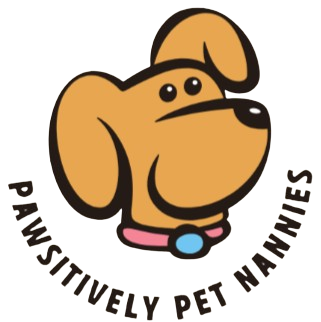

<h1>Pawsitively Pet Nanny - Cuidadores de Pets</h1>

</img>
Bem-vindo ao repositório oficial da Pawsitively Pet Nanny, uma empresa dedicada a cuidar dos seus pets quando você não pode!

---

<h1>Sobre Nós</h1>

A Pawsitively Pet Nanny é uma empresa de cuidadores de pets que oferece serviços de cuidado e entretenimento para os seus animais de estimação enquanto você está ausente. Nossos profissionais são treinados e apaixonados por animais, garantindo o melhor cuidado para o seu amiguinho.

---

<h1>Redes Sociais</h1>

Siga-nos nas redes sociais para ficar por dentro das novidades e dicas para cuidar do seu pet:
<ul>
- <li>[Youtube](https://www.facebook.com/petnanny)</li>
- <li>[Instagram](https://www.instagram.com/petnanny)</li>
- <li>[Twitter](https://www.twitter.com/petnanny)</li>
</ul>

---

## Sobre os Projetos

Nossos projetos são desenvolvidos utilizando as seguintes linguagens e tecnologias:

- **HTML**: Utilizado para a estruturação do conteúdo das páginas web.
- **CSS**: Responsável pela estilização e aparência das nossas interfaces.
- **JavaScript**: Utilizado para tornar nossas páginas web dinâmicas e interativas.
- **MariaDB**: Banco de dados relacional utilizado para armazenar informações importantes do nosso sistema.

---

## Colaboradores

Agradecemos a todos os colaboradores que contribuíram para o desenvolvimento e sucesso dos nossos projetos:

- [Nome do Colaborador 1](link_para_perfil_no_github)
- [Nome do Colaborador 2](link_para_perfil_no_github)
- [Nome do Colaborador 3](link_para_perfil_no_github)

